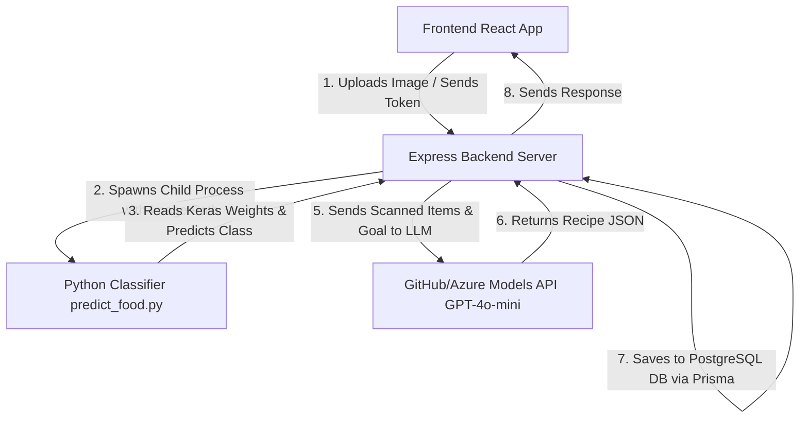

# NutriVision Web Application

NutriVision is a dynamic health and nutrition portal. The application allows users to upload or capture images of food ingredients, runs a custom machine learning model in Python to identify the ingredients, maps their nutritional profiles, and automatically generates personalized recipe recommendations using an LLM. Secure user authentication is powered by Google OAuth.

The project features a **Node.js/Express backend**, a **React/Vite frontend**, and a **dedicated AI module** (both integrated as a child process in backend or running as a standalone FastAPI service).

---

## Table of Contents
1. [Key Features](#key-features)
2. [Project Architecture](#project-architecture)
3. [Dataset](#dataset)
   - [Dataset Sources](#dataset-sources)
   - [Data Preprocessing](#data-preprocessing)
4. [Prerequisites](#prerequisites)
5. [Service Setup & Installation](#service-setup--installation)
   - [1. Backend Setup](#1-backend-setup)
   - [2. Frontend Setup](#2-frontend-setup)
   - [3. AI Model Service Setup (Python/FastAPI)](#3-ai-model-service-setup-pythonfastapi)
6. [Running the Services](#running-the-services)
7. [Troubleshooting & Path Adjustments](#troubleshooting--path-adjustments)

---

## Key Features
* **AI-Powered Ingredient Scan**: Upload or take photos of ingredients to classify them automatically.
* **Nutrition Estimation**: Instant mapping of detected ingredients to nutritional profiles (calories, protein, carbs, fats).
* **Smart Recipe Generator**: Uses an LLM to generate recipes based on scanned items.
  * *1 scanned ingredient* $\rightarrow$ Generates 4 tailored recipes.
  * *2+ scanned ingredients (up to 10)* $\rightarrow$ Generates 8 tailored recipes.
  * Recipes do not need to contain all ingredients in every dish, allowing flexibility.
* **Secure Authentication**: Google OAuth sign-in flow.
* **Modern UI Dashboard**: Rich dashboard displaying history, calories counters, recipes, and detailed guide card visualizations.

---

## Project Architecture



---
## Dataset
---
### Dataset Source
The model is trained on a **combined dataset** of three Kaggle sources, chosen to maximize coverage of both common and Indonesian-local food ingredients:

| # | Dataset | Source | Description |
|---|---------|--------|-------------|
| 1 | Fruit and Vegetable Image Recognition | [Kaggle](https://www.kaggle.com/datasets/kritikseth/fruit-and-vegetable-image-recognition) | General fruits & vegetables, well-labeled with broad class coverage |
| 2 | Ingredients Bahan Makanan Image | [Kaggle](https://www.kaggle.com/datasets/byrux12/ingredients-bahan-makanan-image-gambar) | Indonesian food ingredients, suitable for local recipe context |
| 3 | Dataset Bahan Makanan Mentah | [Kaggle](https://www.kaggle.com/datasets/efanfitriyan/dataset-bahan-makanan-mentah) | Raw ingredients with Indonesian labeling, complements dataset #2 |
| 4 | Combined Dataset (Merged) | [Google Drive](https://drive.google.com/drive/folders/17Urf2EIInYhWO9mAcsi8sKBdjGNk4byf?usp=sharing) | Merged result of the three datasets above, ready to use for training |

> **Why three datasets?**  
> No single dataset covers both global and Indonesian-local ingredients comprehensively. Merging these three sources improves class diversity and model robustness for the NutriVision use case.

---
### Data Preprocessing

All preprocessing steps are documented and reproducible inside the Jupyter Notebook:

```
📓 Notebook_Proses_Data_Nutrivision.ipynb
```

The notebook covers the following pipeline stages:

1. **Data Collection & Merging** — Combines the three Kaggle datasets into a unified directory structure.
2. **Class Filtering & Deduplication** — Removes duplicate or near-duplicate classes across datasets, standardizes class names.
3. **Image Preprocessing**:
   - Resize all images to a consistent input size (e.g. `224x224`)
4. **Data Augmentation** — Applies random flips, rotations, zoom, and brightness shifts to improve generalization.
5. **Train/Validation/Test Split** — Splits the dataset (70/20/10) and organizes into `train/`, `val/`, and `test/` directories.

#### How to Run the Notebook

Make sure your Python environment is active and dependencies are installed:

```bash
pip install tensorflow keras numpy pillow scikit-learn matplotlib pandas jupyter
```

Then launch the notebook:

```bash
jupyter notebook Notebook_Proses_Data_Nutrivision.ipynb
```

Run all cells sequentially. The final output will be:
- A processed dataset folder ready for model training

---
## Prerequisites
Before you start, make sure you have installed:
* **Node.js** (v18.x or later) & **npm**
* **Python** (v3.9 - v3.11 recommended)
* **PostgreSQL Database** running locally or in the cloud.

---

## Service Setup & Installation

### 1. Backend Setup
The backend runs on Express, PostgreSQL (via Prisma ORM), and coordinates the AI classification and LLM calls.

1. **Navigate to the Backend**:
   ```bash
   cd backend
   ```
2. **Install Dependencies**:
   ```bash
   npm install
   ```
3. **Environment Setup**:
   Create a `.env` file based on `.env.example`:
   ```bash
   cp .env.example .env
   ```
   Configure the following keys in your `.env`:
   * `DATABASE_URL`: Your PostgreSQL connection string.
   * `GOOGLE_CLIENT_ID` & `GOOGLE_CLIENT_SECRET`: Your Google credentials.
   * `GITHUB_MODELS_TOKEN`: Your API token for AI-driven recipe generation.
   * `PYTHON_BIN`: Set this to `python` or the path to your python binary in your virtual environment.
   * `MODEL_DIR`: Path to the local model folder (default is `../model_3_best`).
4. **Run Database Migrations & Generate Client**:
   Ensure your database is active, then run:
   ```bash
   npx prisma migrate dev
   npx prisma generate
   ```

---

### 2. Frontend Setup
The frontend is built using React + Vite + Vanilla CSS.

1. **Navigate to the Frontend**:
   ```bash
   cd ../frontend
   ```
2. **Install Dependencies**:
   ```bash
   npm install
   ```
3. **Environment Setup**:
   Create a `.env` file inside the `frontend` folder:
   ```env
   VITE_API_BASE_URL=http://localhost:5050
   VITE_GOOGLE_CLIENT_ID=your-google-client-id.apps.googleusercontent.com
   ```

---

### 3. AI Model Service Setup (Python/FastAPI)
The project includes a standalone AI module inside `model (AI)` directory which runs a FastAPI server for food predictions.

1. **Create & Activate a Python Virtual Environment**:
   It is recommended to run this inside the `model (AI)` folder:
   ```bash
   cd ../"model (AI)"
   python -m venv venv
   # On Windows:
   .\venv\Scripts\activate
   # On macOS/Linux:
   source venv/bin/activate
   ```
2. **Install Python Packages**:
   Install the required dependencies for both backend script execution and FastAPI server:
   ```bash
   pip install tensorflow keras numpy pillow fastapi uvicorn google-generativeai
   ```
3. **Paths Verification in FastAPI (`model (AI)/app.py`)**:
   Open [app.py](file:///c:/Users/I5/Documents/DBS-2026/capstone-project/NutriVision/model%20(AI)/app.py) and update the absolute paths for `MODEL_PATH` and the `class_names.json` file to match your machine directory, or change them to relative paths:
   ```python
   # Example relative path adjustment in app.py
   import os
   BASE_DIR = os.path.dirname(os.path.abspath(__file__))
   MODEL_PATH = os.path.join(BASE_DIR, "models", "food_saved_model")
   CLASS_NAMES_PATH = os.path.join(BASE_DIR, "models", "class_names.json")
   ```

---

## Running the Services

To run NutriVision locally, you will need to boot up the three service layers:

### A. Run the Standalone AI Service (FastAPI)
Ensure your python virtual environment is activated, then run:
```bash
cd "model (AI)"
uvicorn app:app --reload --port 8000
```
This runs the standalone food model prediction API on `http://localhost:8000`.

### B. Run the Backend API Server (Node/Express)
```bash
cd backend
npm run dev
```
The server will boot on `http://localhost:5050`.

### C. Run the Frontend Client (React/Vite)
```bash
cd frontend
npm run dev
```
The client app will boot on `http://localhost:5173`. Open this URL in your web browser.

---

## Troubleshooting & Path Adjustments

#### Cross-Origin Resource Policy (CORP) Error
If scan images fail to render in the browser (`ERR_BLOCKED_BY_RESPONSE` / `NotSameOrigin`):
* The backend has explicit middleware configured in `backend/src/app.js` with `crossOriginEmbedderPolicy: false` in Helmet and set `Cross-Origin-Resource-Policy: cross-origin` for static files. Ensure these settings are active.

#### Python Child Process Execution Failures (Node scan flow)
If food scans fail with internal errors from the backend:
* Check that `PYTHON_BIN` in `backend/.env` points to the active Python interpreter that has `keras`, `tensorflow`, `numpy`, and `pillow` installed.
* Confirm that the Keras weights (`config.json` and `model.weights.h5`) exist in the path set by `MODEL_DIR` (e.g. `model_3_best/`).
